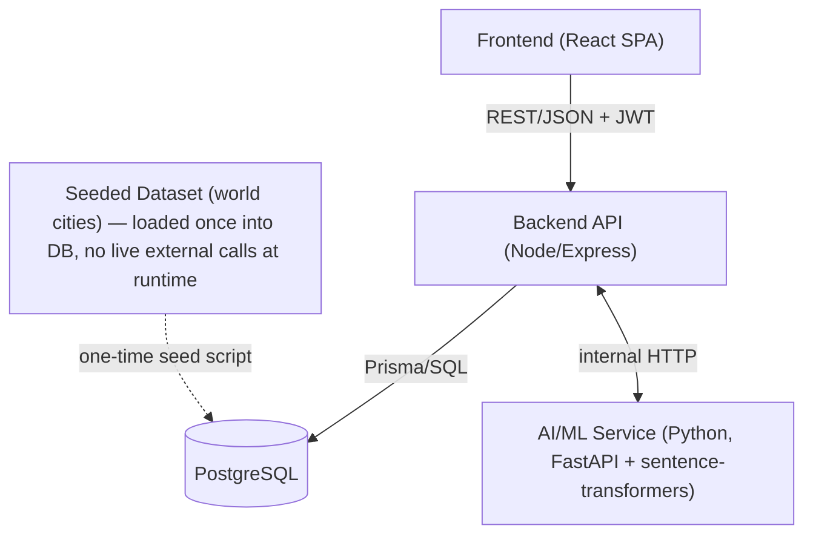
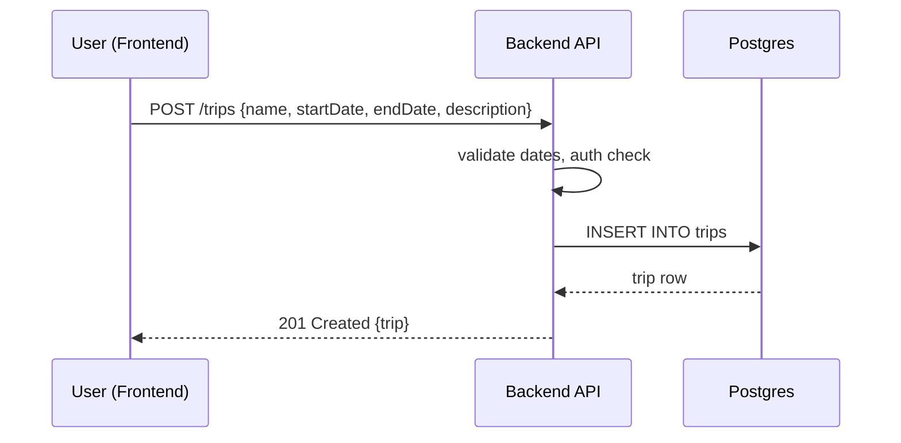
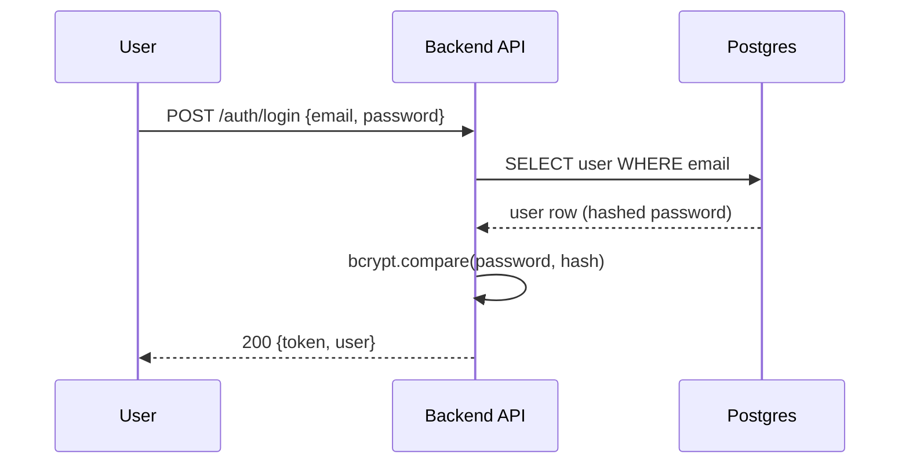
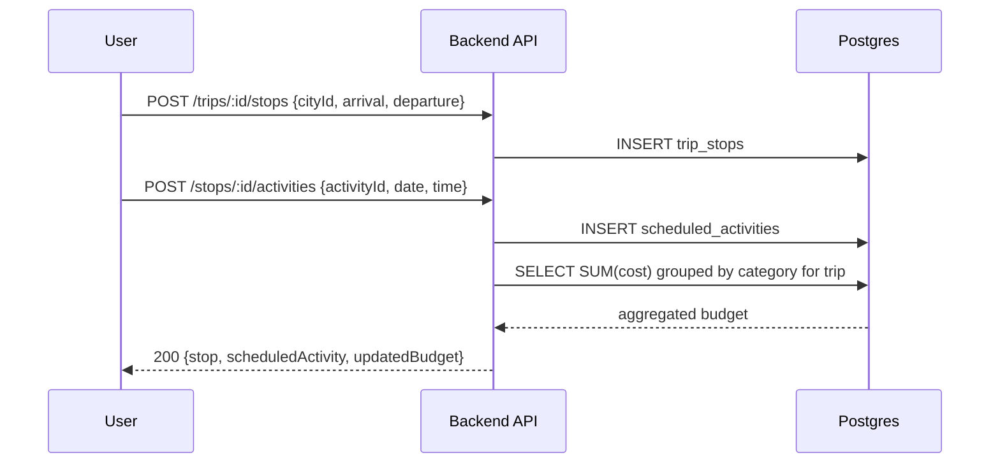
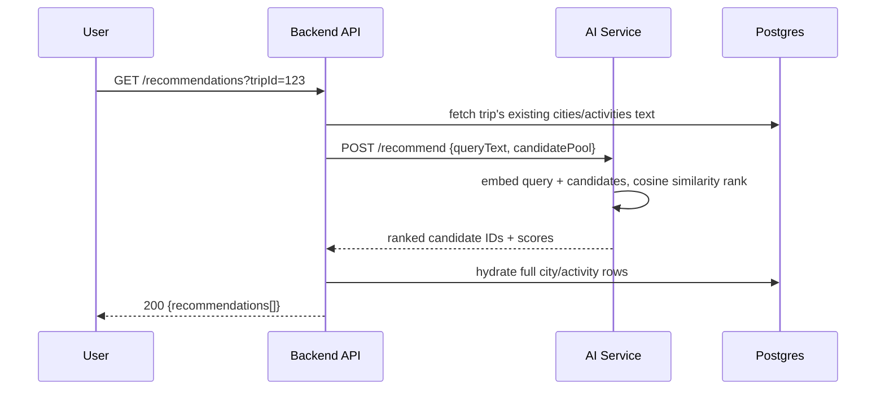
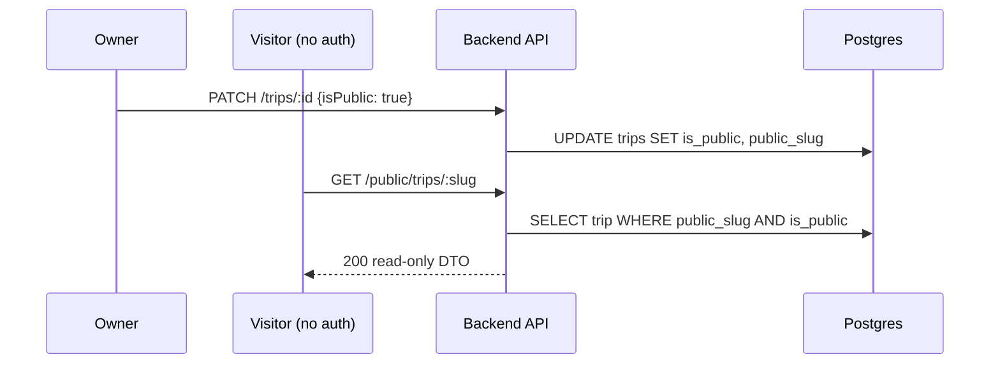

# 04 — System Architecture

## High-Level Diagram

## Component Responsibilities

- **Frontend (React SPA)**: renders all 12–13 screens, owns UI state, calls backend REST API, never talks to the AI service or DB directly.
- **Backend API**: single source of truth for business logic — auth, ownership checks, budget computation, trip-copy logic, sharing logic. Talks to Postgres via Prisma and to the AI service over HTTP.
- **PostgreSQL**: stores all persistent relational data — users, trips, stops, cities, activities, scheduled activities, saved destinations.
- **AI/ML Service**: stateless recommendation service. Given text (interests, existing trip content), returns ranked city/activity IDs by embedding similarity. Called only by the backend, never directly by the frontend.
- **Seeded Dataset**: a static cities (and activities) reference dataset loaded into Postgres once at setup time — not fetched live during the demo, to remove external-API risk.

## Data Flow — Trip Creation

## Data Flow — Authentication

## Data Flow — Itinerary Build (Stop + Activity)

## Data Flow — AI Recommendation

## Data Flow — Sharing

## Notes
- The AI service is intentionally the *only* extra runtime component — everything else is a standard 3-tier web app, which minimizes integration risk given the deadline.
- If the AI service is down or slow, the backend recommendation endpoint falls back to a deterministic query (e.g., "top cities by seeded popularity score not already in the trip") — see `07_AI_ML_SPECIFICATION.md`.
