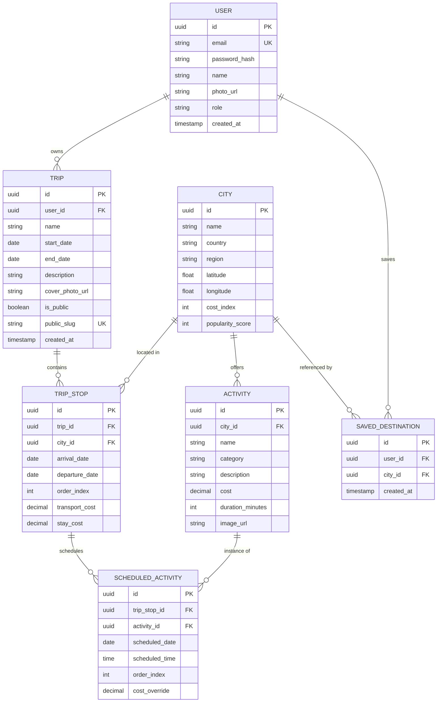

# 05 — Database Design

## Entity List
`User`, `Trip`, `City`, `TripStop`, `Activity`, `ScheduledActivity`, `SavedDestination`. Budget is **derived** (computed from `ScheduledActivity.cost` + `TripStop` transport/stay estimates), not a separate mutable table — this avoids sync bugs between a stored "budget" and the actual itinerary data, and is realistic for a one-day build.

## ERD



## Table Details

### User
- PK: `id` (uuid)
- Unique: `email`
- Columns: `password_hash` (required), `name` (required), `photo_url` (optional), `role` enum `user|admin` (default `user`), `created_at`.
- Indexes: unique index on `email`.

### Trip
- PK: `id`
- FK: `user_id → User.id` (required)
- Columns: `name` (required), `start_date`/`end_date` (required, `end_date >= start_date` constraint), `description` (optional), `cover_photo_url` (optional), `is_public` boolean (default false), `public_slug` (nullable, unique when set).
- Indexes: `user_id`, unique index on `public_slug`.
- Cascade: deleting a `User` cascades to their `Trip`s (or restrict + require explicit account-delete flow — chosen: **cascade**, since FR-22 supports account deletion).

### City
- PK: `id`
- Columns: `name`, `country`, `region`, `latitude`, `longitude`, `cost_index` (1–5), `popularity_score` (int, seeded).
- Indexes: index on `name`, `country` for search performance.
- Seeded reference table — not user-writable via the API.

### TripStop
- PK: `id`
- FK: `trip_id → Trip.id` (required), `city_id → City.id` (required)
- Columns: `arrival_date`, `departure_date` (both within parent trip's range — validated in service layer), `order_index` (for reordering), `transport_cost`, `stay_cost` (decimals, default 0).
- Indexes: `trip_id`, composite `(trip_id, order_index)`.
- Cascade: deleting a `Trip` cascades to its `TripStop`s.

### Activity
- PK: `id`
- FK: `city_id → City.id` (required)
- Columns: `name`, `category` (enum-ish string: sightseeing/food/adventure/culture/relaxation), `description`, `cost` (decimal), `duration_minutes`, `image_url`.
- Indexes: `city_id`, `category`.
- Seeded reference table.

### ScheduledActivity
- PK: `id`
- FK: `trip_stop_id → TripStop.id` (required), `activity_id → Activity.id` (required)
- Columns: `scheduled_date` (must fall within parent stop's date range), `scheduled_time`, `order_index`, `cost_override` (nullable decimal — lets a user tweak the cost for their trip without mutating the shared `Activity.cost`).
- Indexes: `trip_stop_id`, composite `(trip_stop_id, scheduled_date)`.
- Cascade: deleting a `TripStop` cascades to its `ScheduledActivity`s.

### SavedDestination
- PK: `id`
- FK: `user_id → User.id`, `city_id → City.id`
- Unique composite: `(user_id, city_id)` — a user can't save the same city twice.
- Cascade: deletes with the owning `User`.

## Budget Computation (derived, not stored)
```
trip_total = SUM(TripStop.transport_cost + TripStop.stay_cost across all stops)
           + SUM(COALESCE(ScheduledActivity.cost_override, Activity.cost) across all scheduled activities)

category_breakdown = {
  transport: SUM(TripStop.transport_cost),
  stay:      SUM(TripStop.stay_cost),
  activities: SUM(COALESCE(cost_override, Activity.cost) WHERE Activity.category != 'food'),
  meals:     SUM(COALESCE(cost_override, Activity.cost) WHERE Activity.category == 'food')
}
```

## Relationship Explanations
- A `Trip` belongs to one `User`; a `User` can have many `Trip`s.
- A `Trip` has many `TripStop`s (ordered cities visited).
- A `TripStop` references one `City`, but a `City` can appear in many stops across many trips.
- A `TripStop` has many `ScheduledActivity`s (what's planned on which day of that stop).
- A `ScheduledActivity` references one `Activity` (the catalog item) plus stop-specific scheduling metadata.
- `SavedDestination` is a simple join table expressing a user's "wishlist" of cities, independent of any trip.

## Cascade / Delete Strategy
- `User → Trip`: cascade (account deletion removes trips).
- `Trip → TripStop`: cascade.
- `TripStop → ScheduledActivity`: cascade.
- `City → TripStop` / `City → Activity`: **restrict** (cities are seeded reference data; should not be deletable while referenced).
- `Activity → ScheduledActivity`: **restrict** for the same reason.
